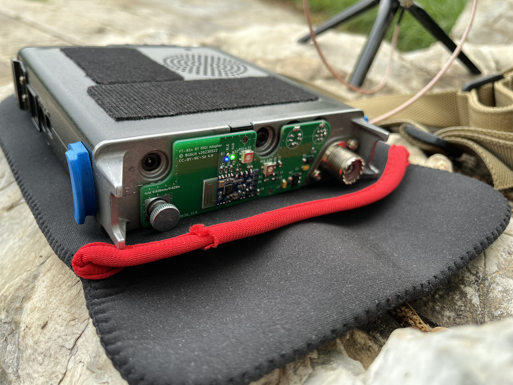
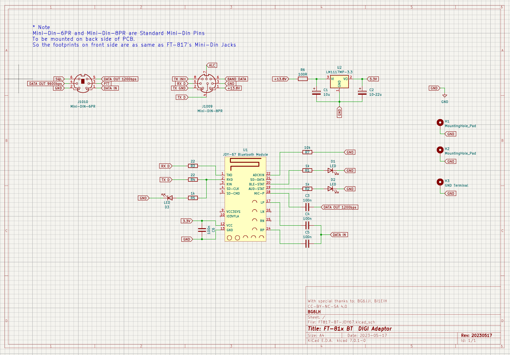
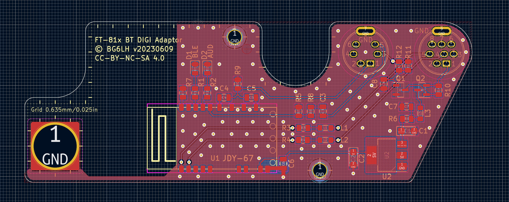
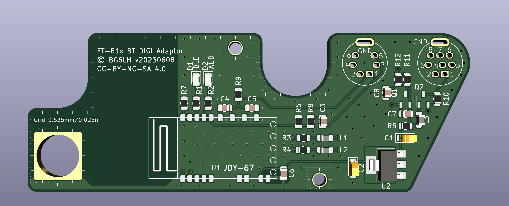

English | [简体中文](./README.zh-CN.md)

# A PCB Design of Bluetooth DIGI Adaptor for Yaesu FT-817/818 Series Transceivers


> **NOTE: This Design is still a Work in Progress. Schematic, PCB, and other stuff might change!**

## Table of Contents
- [Update](#update)
- [Important](#important)
- [Background](#background)
- [Design](#design)
- [Code Repositories](#code-repositories)
- [Configuration of JDY-67](#configuration-of-JDY-67)
- [Related Efforts](#related-efforts)
- [Contributing](#contributing)
- [Maintainers](#maintainers)
- [License](#license)

## Update

### 20230609 Important

<font color=red>The 20230608 version‘s footprint of Q1, Q2 are wrong. Please do not download and wait for the update.</font>

### Updated in 20230608

1. Update LDO LM1117-3.3V to 5V, to provide a constant power for the Bluetooth module;
2. Removed the Zener, and updated R6 to 150Ω, which is close to the ideal value;
~~3. Added power off circuit.~~
4. Replace VR with fixed resistor and optimize the circuit.
5. Updated some symbols and footprints.


### Updated in 20230527

The version 20230522‘s MD6 and MD8 sockets footprints were forgot to be grounded, if you has printed the PCB, you can scrape the green oil next to the shell's big pin, and then solder them together. It will as good as this version 20230527.

20230527's update includes:
1. Modified the symbols and footprints design of MD-6 and MD8 sockets, added pin 9, and grounded. Ensure that will not lost ground when updating from schematic.
2. The power divider resistor R6 is updated to 270Ω, which is close to the ideal value;
3. Added project's kicad symbols and footprints library sharing.


### Updated in 20230522
1. Add 6.2V zener for pre-conditioning before LM1117-3.3
2. Add attenuation network for Line->Mic
3. Add EMI inductor on TXD/RXD pins.
4. Removed TXD's LED.

## Important
1. The FT-817/818's ACC jack always has a constant voltage of 13.8V, even you switched off the rig. We should ***BE VERY CAREFUL*** to avoid short-circuit the PCB and ACC jack accidentally.
2. Meanwhile, aftering installing this adaptor, it will ***ALWAYS*** consume FT-817/818's battery energy. So, A battery with a power switch is recommended. For example, The WindCamp's FT-817/818 lithium battery.
3. If you would purchase a JDY-67 Bluetooth moudle, make sure the firmware version is ***Above 1.3***.

## Background
My friend BG6JJI designed a Bluetooth DIGI adaptor working for many old style TRXs with a Bluetooth, DIGI and CAT ability. He was using a Bluetooth module named JDY-67. I am not sure which manufacturer made the JDY-67. But it's really inexpensive and really works for Bluetooth Audio, and SPP in same time.

So, I pick up an old PCB design for my FT-818. It was design for FT8 cable connecting at very beginning. However, with JDY-67, It should works for Bluetooh/DIGI/CAT. I'd measured the DATA and ACC jacks on FT-818's rear panel, And refering to the FT-817ND's Service Manual, I think the Yaesu's PCB maybe design in a 0.635mm/0.025inch grid. Under this assumption, I'd drawn a PCB that could cover most of the FT-817 rear panel, and perfectly matched all the screw holes, jacks....precisely!!! It looks like a underwear(under-bottom-hardware), right?



Although FT-817/818 has been discontinued, I still love this twenty years selling product. Now, I would like to share this PCB desgin to all HAM communities, If you wanna make your design, you can make any modify from it.


## Design
This PCB was design by KiCad 7.0
In the Layer User.Drawings and User.Comments, there are some information of measurement.
In the Layer User.1~4, there are approximate FT-817/818's panel sketch for comparison.






## Code Repositories

- Github [https://github.com/BG6LH/FT-81x-BT-DIGI-Adaptor](https://github.com/BG6LH/FT-81x-BT-DIGI-Adaptor)
- Gitee [https://gitee.com/bg6lh/FT-81x-BT-DIGI-Adaptor](https://gitee.com/bg6lh/FT-81x-BT-DIGI-Adaptor)


## Configuration of JDY-67

Please note, the JDY-67's default BAUD is 9600bps.

Before connect the adaptor to phone or computer, there are three bluetooth configuration need to be changed. please use those serial port AT instructions:
```sh
AT+SING1\r\n
# Turn on single-ended output 

AT+ROLE0\r\n
# Turn off BLE bluetooth

AT+CALEN1\r\n
# Turn on the phone function

AT+RST\r\n
# Restart the moudule
```
Jdy-67 module serial command must be plus \r\n .

## Related Efforts
- [FT8CN for Android](https://github.com/N0BOY/FT8CN) - Run FT8 natively on Android. This app works well with our Bluetooth DIGI Adaptor.


## Contributing
With special thanks to **BG6JJI, BI1EIH***. They give me many generous advice.

Let's enjoy the FT-817's last lucky underware together!!

## Maintainers
- [@BG6LH(me)](https://github.com/BG6LH)
- [@sgub(BI1EIH)](https://github.com/sgub)

## License

This work is licensed under a
[Creative Commons Attribution-NonCommercial-ShareAlike 4.0 International (CC BY-NC-SA 4.0)][cc-by-nc-sa].

[![CC BY NC SA 4.0][cc-by-nc-sa-image]][cc-by-nc-sa]

[cc-by-nc-sa]: https://creativecommons.org/licenses/by-nc-sa/4.0/
[cc-by-nc-sa-image]: https://i.creativecommons.org/l/by-nc-sa/4.0/88x31.png
