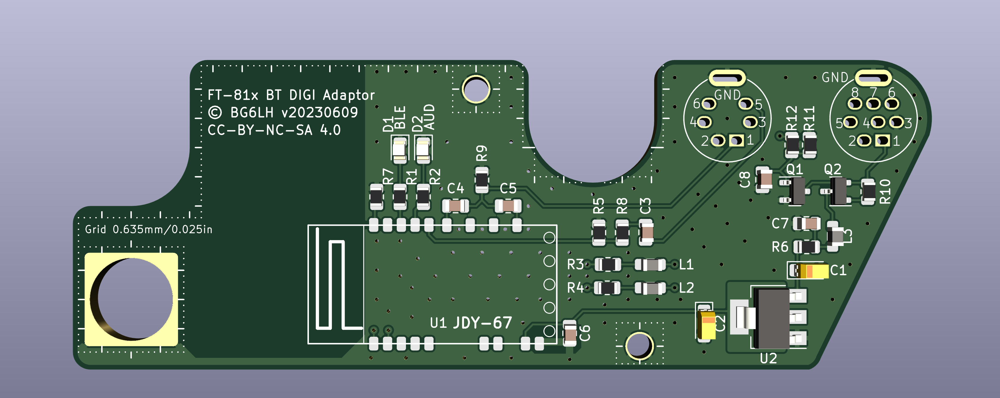

## **NOTE: This Design is still a Work in Progress. Schematic, PCB, and other stuff might change!**

# A PCB Design of Bluetooth DIGI Adaptor for Yaesu FT-817/818 Series transceivers

My friend BG6JJI designed a Bluetooth DIGI adaptor working for many old style TRXs with a Bluetooth, DIGI and CAT ability.

He was using a Bluetooth module named JDY-67. I am not sure which manufacturer made the JDY-67. But it's really inexpensive and really works for Bluetooth, Audio, and SPP in same time.

So, I pick up an old PCB design for my FT-818. It was design for FT8 cable connecting at very beginning. However, with JDY-67, It should works for Bluetooh/Audio/CAT !!!

I'd measured the DATA and ACC jacks on FT-818's rear panel, And refering to the FT-817ND's Service Manual, I think the Yaesu's PCB maybe design in a 0.635mm/0.025inch grid. Under this assumption, I'd drawn a PCB that could cover most of the FT-817 rear panel, and perfectly matched all the screw holes, jacks....precisely!!! It looks like a underwear, right?

Although FT-817/818 has been discontinued, I still love this twenty years selling product. Now, I would like to share this PCB desgin to all HAM communities, If you wanna make your design, you can make any modify from it.

## This PCB was design by KiCad 7.0
In the Layer User.Drawings and User.Comments, there are some information of measurement.
In the Layer User.1~4, there are approximate FT-817/818's panel sketch for comparison.

## With special thanks to: BG6JJI, BI1EIH
They give me many generous advice.

Let's enjoy the FT-817's last lucky underware together!!

BG6LH
2023/05/17

---

## License

This work is licensed under a
[Creative Commons Attribution-NonCommercial-ShareAlike 4.0 International (CC BY-NC-SA 4.0)][cc-by-nc-sa].

[![CC BY NC SA 4.0][cc-by-nc-sa-image]][cc-by-nc-sa]

[cc-by-nc-sa]: https://creativecommons.org/licenses/by-nc-sa/4.0/
[cc-by-nc-sa-image]: https://i.creativecommons.org/l/by-nc-sa/4.0/88x31.png
