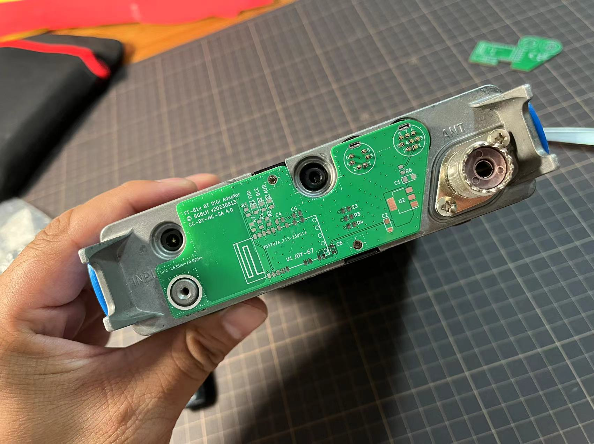

# Yaesu FT-817/818 系列收发信机蓝牙DIGI模式适配器设计


> **注意: 这个设计还在进展中，原理图、电路板和其他设计可能会随时变化！**

## 目录
- [最新更新](#最新更新)
- [重要提示](#重要提示)
- [项目背景](#项目背景)
- [设计](#设计)
- [JDY-67配置](#JDY-67配置)
- [相关项目](#相关项目)
- [贡献者](#贡献者)
- [维护者](#维护者)
- [使用许可](#使用许可)

## 最新更新
20230522 更新
1. 给LM1117-3.3增加了一个6.2V稳压二极管作为保护；
2. 给蓝牙音频线路增加了相应的衰减电路；
3. 蓝牙信号的TXD/RXD线路增加了EMI电感；
4. 取消了原先假设的蓝牙信号指示的LED。

## 重要提示
1. FT-817/818的ACC接口有13.8V的常电压，关机之后也有。大家得 ***非常小心*** 防止ACC接口短路。
2. 另外只要装上这个PCB，它会***一直消耗***FT-817/818的电池。所以最好用一块带电源开关的电池。比如WindCamp的FT-817/818专用锂电池。
3. 购买JDY-67蓝牙模块要买***固件版本1.3以上***的。

## 项目背景
我的朋友BG6JJI设计了一个蓝牙DIGI适配器，可以用在一些老的收发信机上，让它们具备了蓝牙连接、使用数字模式和CAT的能力。他用了一个叫JDY-67的蓝牙模块。我不确定这是哪个厂生产的，但是它真的很便宜，而且同时具备蓝牙音频、SPP透传的能力。

于是我翻出来曾经给FT-818做的一个PCB设计，当时是为了玩FT8时减少插拔数据线对接口的损耗。现在好了，有了JDY-67彻底不摆脱了数据线了。我测量过FT-818后面板上DATA和ACC接口的尺寸，并且参考了FT-817ND的服务手册（Service Manual）。我猜八重洲的PCB设计可能用的是 0.635mm/0.025inch的网格，在这个假设下，我画了一个可以装在后面版上的PCB，并且完美匹配了所有的螺丝孔、插口，相当精确！看看是不是很像一条内裤？（underwear，under-bottom-hardware)？



尽管FT-817/818 系列已经停产了，我还是很喜欢这个卖了20年的产品。这次我打算向全世界的HAM分享这个PCB设计，如果你想做自己的设计，欢迎下载回去修改！


## 设计
PCB用KiCad 7.0设计。
在User.Drawings和User.Comments层，有一些测量的信息。
在User.1到4层有一些近似的FT-817/818后面版草图方便对比。


## JDY-67配置

注意蓝牙模块JDY-67默认的波特率是9600bps。

在使用蓝牙连接之前，需要通过串口调试工具配置三个AT命令：

```sh
AT+SING1\r\n
# 打开单端音频输出 

AT+ROLE0\r\n
# 关掉蓝牙BLE

AT+CALEN1\r\n
# 打开电话功能

AT+RST\r\n
# 重启蓝牙模块
```
向Jdy-67模块发送AT命令须附加\r\n。

## 相关项目
- [FT8CN for Android](https://github.com/N0BOY/FT8CN) - 一个在安卓手机上跑FT8程序的项目，完美配合我们的蓝牙适配器。


## 贡献者
特别感谢**BG6JJI，BI1EIH**，两个无线电老中医给了我很多慷慨的建议和帮助！
让我们一起享受这条FT-817的幸运内裤吧！


## 维护者
- [@BG6LH(me)](https://github.com/BG6LH)
- [@sgub(BI1EIH)](https://github.com/sgub)

## 使用许可

本项目适用
[创作共用协议，署名-非商业性使用-相同方式共享 4.0 国际 (CC BY-NC-SA 4.0)][cc-by-nc-sa]许可方式。分享者不可以将此项目用于商业目的，需保留原作者署名权，修改后以同样的协议共享。

[![CC BY NC SA 4.0][cc-by-nc-sa-image]][cc-by-nc-sa]

[cc-by-nc-sa]: https://creativecommons.org/licenses/by-nc-sa/4.0/
[cc-by-nc-sa-image]: https://i.creativecommons.org/l/by-nc-sa/4.0/88x31.png
